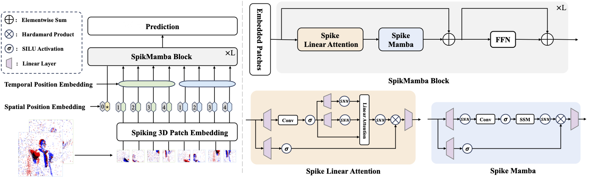

## SpikMamba

[ACM MM Asia 2024 Oral] Official implementation of our paper "SpikMamba: When SNN meets Mamba in Event-based Human Action Recognition".

### [[Paper](https://arxiv.org/pdf/2410.16746)]

[Jiaqi Chen](https://scholar.google.com.hk/citations?hl=zh-CN&pli=1&user=SAjyZRQAAAAJ), [Yan Yang](https://scholar.google.com/citations?user=IF0xw34AAAAJ&hl=en), [Shizhuo Deng](https://scholar.google.com/citations?hl=zh-CN&user=JIsc3akAAAAJ), [Teng Da](https://scholar.google.com/citations?hl=zh-CN&user=sRbvXgIAAAAJ) and [Liyuan Pan](https://scholar.google.com/citations?user=kAt6-AIAAAAJ&hl=en)\*

> **Abstract:**  Human action recognition (HAR) plays a key role in various applications such as video analysis, surveillance, autonomous driving, robotics, and healthcare. Most HAR algorithms are developed from RGB images, which capture detailed visual information. However, these algorithms raise concerns in privacy-sensitive environments due to the recording of identifiable features. Event cameras offer a promising solution by capturing scene brightness changes sparsely at the pixel level, without capturing full images. Moreover, event cameras have high dynamic ranges that can effectively handle scenarios with complex lighting conditions, such as low light or high contrast environments. However, using event cameras introduces challenges in modeling the spatially sparse and high temporal resolution event data for HAR. To address these issues, we propose the SpikMamba framework, which combines the energy efficiency of spiking neural networks and the long sequence modeling capability of Mamba to efficiently capture global features from spatially sparse and high a temporal resolution event data. Additionally, to improve the locality of modeling, a spiking window-based linear attention mechanism is used. Extensive experiments show that SpikMamba achieves remarkable recognition performance, surpassing the previous state-of-the-art by 1.45%, 7.22%, 0.15%, and 3.92% on the PAF, HARDVS, DVS128, and E-FAction datasets, respectively.



## 📑 Contents

code will be released later!

- [Dataset](#dataset)
- [Results](#results)
- [Installation](#installation)
- [Training](#training)
- [Testing](#testing)
- [Citation](#cite)

## <a name="todo"></a> 📂 Dataset

Due to storage capacity limitations, we have initially released the complete dataset at a resolution of 1200x800. The dataset has been divided into training and test sets following the settings described in the paper. The download instructions are as follows:


| Dataset       |                                        Access to Download Datasets                                        |
| :------------ | :--------------------------------------------------------------------------------------------------------: |
| PAF           |                         [Download](https://github.com/CrystalMiaoshu/PAFBenchmark)                         |
| DVS128Gesture | [Download](https://research.ibm.com/publications/a-low-power-fully-event-based-gesture-recognition-system) |
| HARDVS        |                              [Download](https://github.com/Event-AHU/HARDVS)                              |

## <a name="installation"></a> ⚙️ Installation

Clone this repo:

### Previous installation

To use the selective scan with efficient hard-ware design, the `mamba_ssm` library is needed to install with the folllowing command.

```
pip install causal_conv1d==1.0.0
pip install mamba_ssm==1.0.1
```

One can also create a new anaconda environment, and then install necessary python libraries with "./requirement.txt" and the following command:

```
pip install -r requirements.txt
```

## <a name="training"></a>  🔥 Training


Due to time constraints, we will showcase all the models during the testing process and will clean up the code subsequently.

1、The frame representation of PAF can be referenced as follows:
2、Training: you can use the folders in: /Train_efaction/, Train_HARdvs/, Train_PAF/, and Train_seact/. The models are located in the /model folder.

for example：

```

bash run/runhardvsafemllaspik.sh

```

## <a name="cite"></a> 🥰 Citation

```
@inproceedings{chen2024spikmamba,
  title={Spikmamba: When snn meets mamba in event-based human action recognition},
  author={Chen, Jiaqi and Yang, Yan and Deng, Shizhuo and Teng, Da and Pan, Liyuan},
  booktitle={Proceedings of the 6th ACM International Conference on Multimedia in Asia},
  pages={1--8},
  year={2024}
}
}
```

## License

This project is released under the [Apache 2.0 license](LICENSE).

## Acknowledgement

The code is borrowed from the following repositories, thanks for sharing.

- [Spikformer](https://github.com/ZK-Zhou/spikformer)
- [Exact](https://vlislab22.github.io/ExACT)
- [VMamba](https://github.com/MzeroMiko/VMamba)
- [MambaIR](https://github.com/csguoh/MambaIR)

## Contact

Feel free to contact me at **2270691@stu.neu.edu.cn** if you have any questions.
