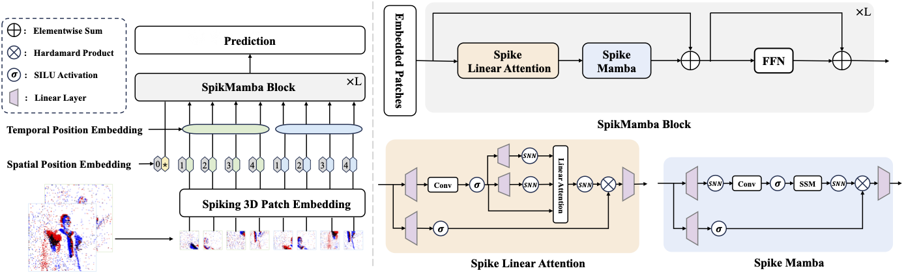

# SpikMamba

code will be released later!

[paper](https://arxiv.org/abs/2410.16746)

## Abstract:

Human action recognition (HAR) plays a key role in various applications such as video analysis, surveillance, autonomous driving, robotics, and healthcare. Most HAR algorithms are developed from RGB images, which capture detailed visual information. However, these algorithms raise concerns in privacy-sensitive environments due to the recording of identifiable features. Event cameras offer a promising solution by capturing scene brightness changes sparsely at the pixel level, without capturing full images. Moreover, event cameras have high dynamic ranges that can effectively handle scenarios with complex lighting conditions, such as low light or high contrast environments. However, using event cameras introduces challenges in modeling the spatially sparse and high temporal resolution event data for HAR. To address these issues, we propose the SpikMamba framework, which combines the energy efficiency of spiking neural networks and the long sequence modeling capability of Mamba to efficiently capture global features from spatially sparse and high a temporal resolution event data. Additionally, to improve the locality of modeling, a spiking window-based linear attention mechanism is used. Extensive experiments show that SpikMamba achieves remarkable recognition performance, surpassing the previous state-of-the-art by 1.45%, 7.22%, 0.15%, and 3.92% on the PAF, HARDVS, DVS128, and E-FAction datasets, respectively. The code is available at this https URL.